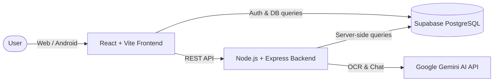

# SpendIt (Paisa Buddy)

A comprehensive personal finance and expense tracking application powered by AI.

## Overview

SpendIt (internally known as Paisa Buddy) helps users seamlessly manage their finances, track daily expenses, and gain intelligent insights into their spending habits. By integrating an AI-powered receipt scanner and chatbot, SpendIt removes the friction from manual data entry and offers personalized financial advice, making it the perfect tool for anyone looking to take control of their budget.

## Key Features

- **Expense Tracking:** Log, categorize, and monitor expenses effortlessly.
- **AI Receipt OCR:** Automatically extract data from receipts using Gemini AI.
- **Financial Chatbot:** Ask questions about your spending and get AI-driven insights.
- **Cross-Platform:** Available on the web and as an Android app (via Capacitor).
- **Secure Authentication:** User management and secure data storage powered by Supabase.
- **Interactive Dashboards:** Visualize financial data with beautiful, responsive charts.

## Tech Stack

- **Frontend:** React 19, Vite, Tailwind CSS 4, React Router, Recharts, Framer Motion
- **Backend:** Node.js, Express, Zod, Helmet, Google GenAI SDK
- **Database & Auth:** Supabase (PostgreSQL)
- **Mobile:** Capacitor (Android)

## Architecture



## Project Structure

```text
SpendIt/
├── frontend/             # React application (Web & Mobile views)
│   ├── android/          # Capacitor Android project
│   ├── src/              # React source code
│   └── vite.config.js    # Vite configuration
├── backend/              # Node.js API server
│   ├── routes/           # API endpoints (auth, expenses, ai)
│   ├── models/           # Data models and schemas
│   └── server.js         # Entry point
├── supabase/             # Database schema and SQL migrations
├── package.json          # Root configuration for concurrent execution
├── .env.example          # Example root environment file
└── .gitignore            # Git ignore rules
```

## Installation

### Prerequisites

- Node.js (v18 or higher)
- npm or yarn
- A Supabase account and project
- A Google Gemini API Key

### Clone Repository

```bash
git clone https://github.com/ujjawalX19/Spendly.git
cd Spendly
```

### Install Dependencies

You can install dependencies for the root, frontend, and backend all at once:

```bash
npm run install:all
```

*(Alternatively, run `npm install` in the root, `frontend`, and `backend` directories individually).*

### Environment Variables

You need to set up environment variables for both the frontend and backend.

**Backend (`backend/.env`):**
Copy `backend/.env.example` to `backend/.env` and fill in your keys:
```env
PORT=5000
SUPABASE_URL=https://your-project-ref.supabase.co
SUPABASE_SERVICE_ROLE_KEY=your-service-role-key-here
GEMINI_API_KEY=your-gemini-api-key-here
NODE_ENV=development
FRONTEND_URL=http://localhost:5173
```

**Frontend (`frontend/.env.local`):**
Copy `frontend/.env.example` to `frontend/.env.local` and fill in your keys:
```env
VITE_SUPABASE_URL=https://your-project-ref.supabase.co
VITE_SUPABASE_ANON_KEY=your-supabase-anon-key-here
VITE_AI_BACKEND_URL=http://localhost:5000
VITE_API_URL=http://localhost:5000/api
```

### Database Setup

Run the SQL scripts located in the `supabase/` directory in your Supabase project's SQL editor to set up the necessary tables and security policies.

### Run Development Server

To start both the backend server and the frontend Vite development server concurrently:

```bash
npm run dev
```

- Frontend: `http://localhost:5173`
- Backend: `http://localhost:5000`

### Build for Production (Web)

```bash
npm run build
```

### Build for Android

```bash
npm run build:android
```
*Requires Android Studio and appropriate SDKs to be installed.*

## API Documentation

The backend exposes several REST API endpoints.

| Method | Endpoint              | Description                                      |
| ------ | --------------------- | ------------------------------------------------ |
| POST   | `/api/auth/...`       | Handles user authentication operations.          |
| POST   | `/api/ai/receipt`     | Processes a receipt image using Gemini OCR.      |
| POST   | `/api/ai/chat`        | Sends queries to the financial AI chatbot.       |

*(Detailed endpoints can be found in the `backend/routes/` directory).*

## Future Improvements

- Implementation of multi-currency support.
- Push notifications for budget limits and bill reminders.
- Exporting financial reports to PDF/CSV.
- Plaid integration for automatic bank transaction syncing.

## License

This project is currently unlicensed. Please contact the repository owner regarding usage rights.

## Author

**Ujjawal** - [ujjawalX19](https://github.com/ujjawalX19)
