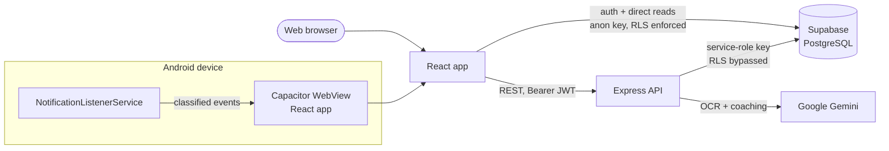

# Vittova

**Your Money's Pulse.** Website: https://vittova.in

> Vittova was previously branded **Spendly**. Some technical identifiers keep the old name on purpose (the `spendly://` auth deep links, database/storage keys, the GitHub repository and Render service names). See [REBRAND_VITTOVA.md](REBRAND_VITTOVA.md).

A personal financial co-pilot for India. Vittova tracks what you spend — mostly
without you typing anything — explains where it went, and tells you what you
can safely spend next.

## The problem

Indian expense apps tell you what you already know: you spent ₹12,000 this
month. That is a receipt, not help. And keeping them fed means manually
entering every UPI payment, which almost nobody sustains past week two.

## The approach

**Track without typing.** Vittova reads the payment notifications your UPI and
banking apps already post — with your explicit permission, and nothing else —
and turns the real ones into expenses. It does not read SMS.

**Answer the question you actually have.** Not "you spent ₹12,000" but "you can
safely spend about ₹850 a day until your next income", with the assumptions
shown.

**Say something useful.** Unusual spending, forgotten subscriptions, and a
plain-English explanation of why this month cost more than last.

---

## Features

**Automatic UPI tracking.** Recognises payment notifications from 30 UPI and
bank apps, classifies each one as an expense, income, refund, failed
transaction, or not-a-transaction, and deduplicates the reposts and
bank-plus-app echoes that would otherwise double-count a payment. When it is
not confident, it asks instead of guessing.

**Safe-to-Spend.** Monthly budget minus what you have spent, minus upcoming
recurring bills, minus your savings target, divided by the days left — all
computed on the Indian calendar, not the server's.

**Dashboard.** What you spent, what is left, where it went, and whether you are
on track.

**Receipt scanning.** Gemini Vision extracts the total and line items from a
photo, with card and account numbers stripped.

**AI financial coach.** Answers questions about your own spending.

**Subscription detection.** Finds recurring payments and shows what they cost
you a year.

**Spend Score, streaks, burn rate.** Light gamification around actually logging
things.

**Hostel Pool.** Shared expenses and settling up with friends.

**Your data is yours.** One-tap CSV export, and account deletion that actually
deletes.

---

## Tech stack

| Layer | Choice |
|---|---|
| Frontend | React 19, Vite 7, Tailwind CSS 4, React Router 7, Recharts, Framer Motion |
| Mobile | Capacitor 8 (Android), custom `NotificationListenerService` |
| Backend | Node.js, Express 5, Zod, Helmet, express-rate-limit |
| Database & auth | Supabase (PostgreSQL + RLS) |
| AI | Google Gemini |
| Hosting | Vercel (web), Render (API) |

## Architecture



The frontend talks to Supabase directly for auth and simple reads, using the
public anon key under Row Level Security. Anything requiring aggregation,
privileged writes, or an API key goes through the Express backend.

**The backend holds the service-role key and therefore bypasses RLS.** Every
backend route must scope its own queries by `req.user.id` — the database will
not catch a missing filter. See `SECURITY.md`.

## Project structure

```text
Vittova/
├── backend/
│   ├── lib/            # appTime (timezone), streak, csv — pure and tested
│   ├── middleware/     # auth, proGate (server-side free-tier limits)
│   ├── routes/         # expenses, groups, ai, pro, safe-to-spend, ...
│   ├── jobs/           # daily burn-rate checker
│   └── tests/          # node:test suites
├── frontend/
│   ├── android/        # Capacitor project + notification listener (Java)
│   └── src/
│       ├── lib/        # supabaseClient, apiConfig, errors
│       ├── contexts/   # Auth, Pro, Theme
│       ├── hooks/      # useExpenses, usePaymentNotifications
│       └── pages/      # Dashboard, Chatbot, Settings, ...
└── supabase/           # schema + migrations, applied in order
```

---

## Setup

**Prerequisites:** Node.js 18+, a Supabase project, a Gemini API key, and
Android Studio if you are building the app.

```bash
git clone https://github.com/ujjawalX19/Spendly.git
cd Vittova
npm run install:all
```

### Environment

```bash
cp backend/.env.example  backend/.env
cp frontend/.env.example frontend/.env.local
```

| Variable | Where | Notes |
|---|---|---|
| `SUPABASE_URL` | backend | |
| `SUPABASE_SERVICE_ROLE_KEY` | backend | **Never** in the frontend or the APK |
| `GEMINI_API_KEY` | backend | |
| `NODE_ENV` | backend | `production` suppresses stack traces in responses |
| `ALLOWED_ORIGINS` | backend | Comma-separated CORS allow-list |
| `APP_TIMEZONE` | backend | Optional, defaults to `Asia/Kolkata` |
| `VITE_SUPABASE_URL` | frontend | |
| `VITE_SUPABASE_ANON_KEY` | frontend | Public by design; safe only because RLS is on |
| `VITE_API_URL` | frontend | Baked in at build time |

### Database

Run these in the Supabase SQL Editor, **in order**:

1. `supabase/schema.sql`
2. `supabase/v1_schema_extension.sql`
3. `supabase/security_hardening.sql`
4. `supabase/v1_1_launch_hardening.sql`

Then run the verification queries at the end of step 4 and confirm RLS is on
everywhere and the `profiles` update grant covers only three columns.

### Run

```bash
npm run dev          # backend :5000 + frontend :5173
```

---

## Testing

```bash
cd backend
npm test             # 33 unit tests: timezone math, streaks, CSV
npm run test:tz      # the same suite under three server timezones

cd ../frontend
npm run lint
npm run build

cd android
./gradlew testDebugUnitTest   # 32 notification-parser tests
```

The timezone suite runs under several server timezones on purpose. The single
largest class of bug found during the launch audit was calendar math that
worked on a developer's IST laptop and silently misattributed a month's
spending on a UTC production server.

---

## Deployment

See `RELEASE.md`. In short: migration first, Supabase redirect URLs second,
signed AAB third.

## Security

See `SECURITY.md` for the threat model, secret handling, premium-bypass
prevention, and how to report a vulnerability.

## Privacy

Vittova stores your email, display name, and the expenses you record.
Notification content is processed on-device and never logged or transmitted
verbatim. Receipt images are sent to Google Gemini for OCR. You can export
everything as CSV and delete your account and all its data from within the app.
The in-app Privacy Policy is the authoritative version.

## Roadmap

See `ROADMAP.md`.

## Status

Pre-launch. `LAUNCH_TODO.md` tracks what is done, what is open, and what is
blocked on external credentials.

## License

Unlicensed — all rights reserved. Contact the author regarding use.

## Author

**Ujjawal** — [@ujjawalX19](https://github.com/ujjawalX19)
